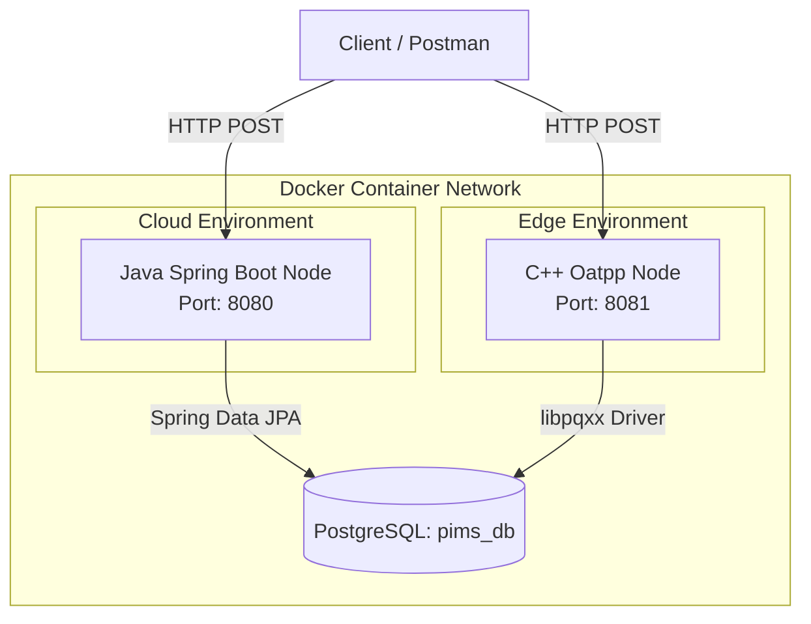

<<<<<<< HEAD
# IKOS-PIMS: Passenger Information Management System

A high-performance, distributed backend proof-of-concept designed for modern rail networks. 

This repository demonstrates the architectural trade-offs between centralized cloud processing and localized edge computing by implementing a unified Passenger Registry across two distinct technology stacks: **Java (Spring Boot)** and **C++ (Oatpp)**.

---

## 🏗️ Architectural Strategy

In modern transit systems, data integrity must be maintained across diverse hardware environments. This project showcases a "Dual-Stack" approach:

1. **The Cloud Node (Java / Spring Boot):** Designed for enterprise-scale centralized processing, utilizing the JVM for rapid development and robust ecosystem integration.
2. **The Edge Node (C++ / Oatpp):** A low-latency, memory-safe implementation designed for resource-constrained station hardware or on-board train servers.

**The Unified State:** Both microservices are operationally independent but target a shared PostgreSQL instance. Transactional integrity is enforced via **database-level pessimistic locking**, ensuring zero-risk of double-booking or manifest corruption regardless of which service handles the request.

---

## 🗺️ System Architecture

The environment is fully containerized using Docker Compose to ensure a "one-click" evaluation experience.




Technology MatrixFeatureJava ImplementationC++ ImplementationFrameworkSpring Boot 3.xOatppData AccessSpring Data JPA (Hibernate)Native SQL (libpqxx)ConcurrencyManaged Thread PoolAsynchronous Event LoopMemory MgmtJVM Garbage CollectionRAII & Smart PointersBuild SystemMavenCMake & vcpkg🗄️ Database Schema (ERD)The system utilizes a relational schema optimized for high-concurrency ticketing operations.Code snippeterDiagram
    PASSENGERS {
        uuid id PK "Default: uuid_generate_v4()"
        varchar first_name "Not Null"
        varchar last_name "Not Null"
        varchar ticket_status "Default: 'CONFIRMED'"
        timestamp created_at "Default: NOW()"
    }
🚀 Deployment & Quick StartPrerequisitesDocker and Docker Compose installed.ExecutionClone and Initialize:Bashgit clone [https://github.com/johdanike/IKOS-PIMS.git](https://github.com/johdanike/IKOS-PIMS.git)
cd IKOS-PIMS
One-Click Build & Start:Bashdocker-compose up --build -d
Note: This command will initialize the database, compile the C++ binary via vcpkg, and launch the Java JAR.Verify Services:Java API: http://localhost:8080/api/v1/passengersC++ API: http://localhost:8081/api/v1/passengersPostgres: localhost:5432🔌 API Contract & TestingBoth backends honor the same RESTful contract. A Postman collection (IKOS_Postman_Collection.json) is included in the root directory for automated testing.Sample Request:Bashcurl -X POST http://localhost:8081/api/v1/passengers \
-H "Content-Type: application/json" \
-d '{"firstName": "Ada", "lastName": "Lovelace"}'
Sample Response:JSON{
  "id": "e4b3b2a1-1234-5678-9abc-def012345678",
  "firstName": "Ada",
  "lastName": "Lovelace",
  "ticketStatus": "CONFIRMED"
}
🛣️ Roadmap & Future ArchitectureWhile this MVP utilizes a standard layered MVC approach for rapid delivery, the system is designed to scale into more robust enterprise patterns:[ ] Domain Isolation (Hexagonal Architecture): Refactor the current layered architecture into a Ports and Adapters pattern. This will strictly isolate the core Passenger Domain logic from the HTTP delivery mechanism (Oatpp/Spring Web) and the persistence adapters (libpqxx/JPA).[ ] Schedule Engine: Integration of static GTFS data for route management.[ ] Telemetry Pipeline: MQTT stream processing for real-time train GPS coordinates.[ ] Display Controller: C++ edge service for LCD/LED hardware command translation.
=======
# IKOS-PIMS: Passenger Information Management System

A high-performance, distributed backend proof-of-concept designed for modern rail networks. 

This repository demonstrates the architectural trade-offs between centralized cloud processing and localized edge computing by implementing a unified Passenger Registry across two distinct technology stacks: **Java (Spring Boot)** and **C++ (Oatpp)**.

---

## 🏗️ Architectural Strategy

In modern transit systems, data integrity must be maintained across diverse hardware environments. This project showcases a "Dual-Stack" approach:

1. **The Cloud Node (Java / Spring Boot):** Designed for enterprise-scale centralized processing, utilizing the JVM for rapid development and robust ecosystem integration.
2. **The Edge Node (C++ / Oatpp):** A low-latency, memory-safe implementation designed for resource-constrained station hardware or on-board train servers.

**The Unified State:** Both microservices are operationally independent but target a shared PostgreSQL instance. Transactional integrity is enforced via **database-level pessimistic locking**, ensuring zero-risk of double-booking or manifest corruption regardless of which service handles the request.

---

## 🗺️ System Architecture

The environment is fully containerized using Docker Compose to ensure a "one-click" evaluation experience.

```mermaid
graph TD
    Client[Client / Postman]
    
    subgraph Docker Container Network
        DB[(PostgreSQL: pims_db)]
        
        subgraph Cloud Environment
            Spring[Java Spring Boot Node\nPort: 8080]
        end
        
        subgraph Edge Environment
            Oatpp[C++ Oatpp Node\nPort: 8081]
        end
    end

    Client -->|HTTP POST| Spring
    Client -->|HTTP POST| Oatpp

    Spring -->|Spring Data JPA| DB
    Oatpp -->|libpqxx Driver| DB
⚙️ Technology MatrixFeatureJava ImplementationC++ ImplementationFrameworkSpring Boot 3.xOatpp / DrogonData AccessSpring Data JPA (Hibernate)Native SQL (libpqxx)ConcurrencyManaged Thread PoolAsynchronous Event LoopMemory MgmtJVM Garbage CollectionRAII & Smart PointersBuild SystemMavenCMake & vcpkg🗄️ Database Schema (ERD)The system utilizes a relational schema optimized for high-concurrency ticketing operations.Code snippeterDiagram
    PASSENGERS {
        uuid id PK "Default: uuid_generate_v4()"
        varchar first_name "Not Null"
        varchar last_name "Not Null"
        varchar ticket_status "Default: 'CONFIRMED'"
        timestamp created_at "Default: NOW()"
    }
🚀 Deployment & Quick StartPrerequisitesDocker and Docker Compose installed.ExecutionClone and Initialize:Bashgit clone [https://github.com/johdanike/IKOS-PIMS.git](https://github.com/johdanike/IKOS-PIMS.git)
cd IKOS-PIMS
One-Click Build & Start:Bashdocker-compose up --build
Note: This command will initialize the database, compile the C++ binary from source, and launch the Java JAR.Verify Services:Java API: http://localhost:8080/api/v1/passengersC++ API: http://localhost:8081/api/v1/passengersPostgres: localhost:5432🔌 API Contract & TestingBoth backends honor the same RESTful contract. A Postman collection (IKOS_Postman_Collection.json) is included in the root for automated testing.Sample Request:Bashcurl -X POST http://localhost:8081/api/v1/passengers \
-H "Content-Type: application/json" \
-d '{"firstName": "Ada", "lastName": "Lovelace"}'
Sample Response:JSON{
  "id": "e4b3b2a1-1234-5678-9abc-def012345678",
  "firstName": "Ada",
  "lastName": "Lovelace",
  "ticketStatus": "CONFIRMED"
}
🛣️ Roadmap[ ] Schedule Engine: Integration of static GTFS data for route management.[ ] Telemetry Pipeline: MQTT stream processing for real-time train GPS coordinates.[ ] Display Controller: C++ edge service for LCD/LED hardware command translation.
>>>>>>> 1308479 (fix: transition from vcpkg to native linux binaries for optimized libpqxx compilation)
